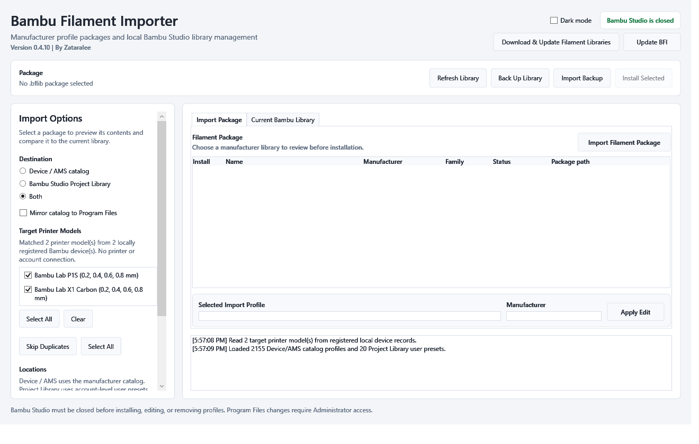
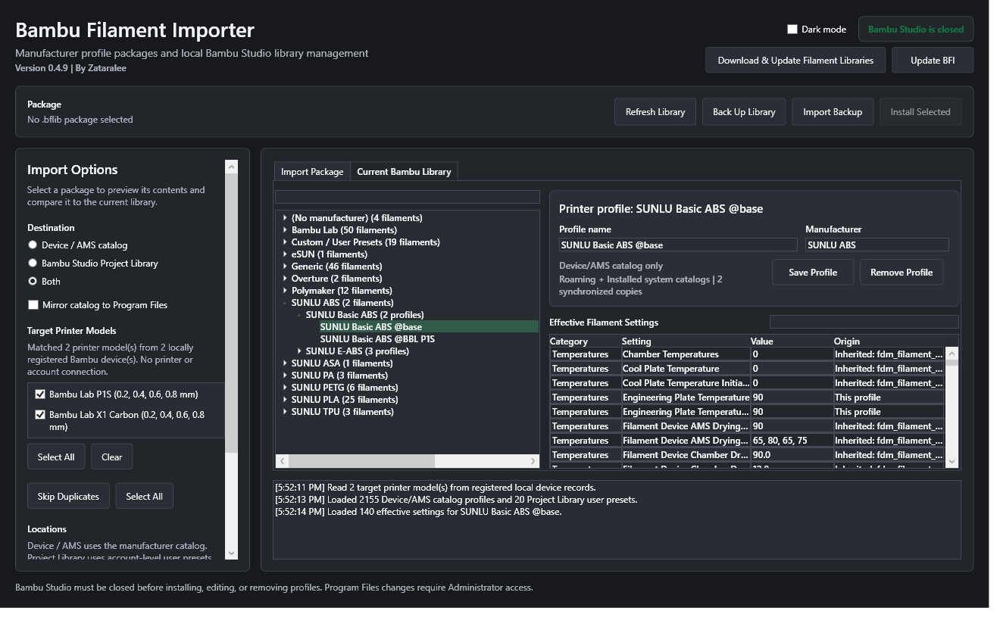

# Bambu Filament Importer

**Version 0.4.5 | By Zataralee**

<p align="center"></p>

A native Windows desktop utility for importing, organizing, editing, backing up, and removing manufacturer filament profiles in Bambu Studio.

[Download the latest release](../../releases/latest) | [Report a problem](../../issues/new/choose) | [Request a filament profile](../../issues/new/choose)



## Why This Exists

Bambu Studio stores filament presets in several locations and associates system presets with compatible printer definitions. Bambu Filament Importer provides one manufacturer-level `.bflib` package while generating the required per-printer profiles at installation time.

The importer identifies locally registered printer models from the user's own Bambu Studio configuration, then uses enabled machine presets only as a clearly labeled fallback. A package is therefore not tied to the original developer's printers.

## Included Libraries

The repository currently provides nine independently importable manufacturer packages containing 243 product families:

| Manufacturer | Products |
| --- | ---: |
| SUNLU | 40 |
| Polymaker | 48 |
| eSUN | 36 |
| Fiberlogy | 25 |
| Prusament | 22 |
| Spectrum Filaments | 22 |
| Fillamentum | 20 |
| MatterHackers | 16 |
| Overture | 14 |

Official source references and catalog policy are documented in [catalogs/README.md](catalogs/README.md). Product families are represented once; color variants are not separate presets.

## Features

- Imports printer-neutral manufacturer libraries to selected Bambu Studio printer models.
- Reads locally registered printer models from Bambu Studio and excludes unrelated enabled presets when device records are available.
- Compares actual `compatible_printers` coverage and generates only missing profiles.
- Handles Bambu's P1S/P1P live-device identity crossover so P1-family profiles remain visible in the AMS material picker.
- Imports to the Device/AMS catalog, Project Library, or both.
- Scans the current library as Manufacturer > Filament > printer profile.
- Displays and edits direct and inherited temperatures, cooling, drying, flow, retraction, and calibration values.
- Renames and removes individual profiles, complete filaments, or manufacturers.
- Detects duplicates and preserves existing compatible Bambu presets.
- Audits and repairs AMS filament IDs that are too long or collide after printer synchronization.
- Creates complete `.bflbackup` library backups and merges them during restoration.
- Creates safety backups before changing Bambu Studio files.
- Validates the complete catalog before and after installation and rolls back a failed write automatically.
- Monitors Bambu Studio continuously, locks the workspace whenever it opens, and refreshes local records when it closes.
- Detects packaged profiles left only in an inactive Program Files mirror after a Bambu catalog refresh and loads the affected package for repair.
- Checks GitHub Releases and installs confirmed updates in place.
- Supports persistent light and dark modes.

BFI does not connect to Bambu printers or Bambu Cloud and does not read account credentials or access-code values. Local device identifiers are used only to identify printer models and are never displayed, logged, or transmitted. Network access is used only when the user selects **Check for updates**, and the request goes to this repository's GitHub Releases API.



## Getting Started

1. Download the current Windows release and extract it to a normal writable folder.
2. Close Bambu Studio.
3. Start `BambuFilamentImporter.exe`.
4. Open the **Import Package** tab and select **Import Filament Package**.
5. Choose a `.bflib` file from the included `Manufacturer Libraries` folder.
6. Select the destination and target printer models, review duplicates, and install.

Program Files mirroring requires Administrator access. Normal roaming-catalog and Project Library imports do not.

## Safety

Manufacturer temperature ranges are starting points. Flow ratio and maximum volumetric speed require calibration for the individual printer, nozzle, and spool. Abrasive composites require appropriate hardened components and nozzle size.

Back up the library before extensive changes. The application can create a complete `.bflbackup` from the toolbar.

## `.bflib` Format

A `.bflib` file is a ZIP archive containing:

- `manifest.json`
- printer-neutral manufacturer filament JSON files listed by the manifest
- official source URLs and package compatibility notes in the manifest

The package does not contain hard-coded printer names. The importer creates compatible child profiles only for printer models selected at installation time.

AMS filament IDs are limited to eight characters and must be unique. The importer normalizes package IDs during installation and can repair older installed libraries from the **Current Bambu Library** tab.

## Building

Requirements:

- Windows 10 or later
- .NET 10 SDK
- PowerShell 7 for catalog generation scripts

```powershell
& .\tools\BuildManufacturerPackages.ps1
dotnet run --project .\Tests\SmokeTests.csproj -c Release
dotnet publish .\BambuFilamentImporter.csproj -c Release -r win-x64 --self-contained true `
  -p:PublishSingleFile=true -p:IncludeNativeLibrariesForSelfExtract=true
```

The smoke suite uses a local Bambu Studio installation for read-only integration checks and isolated temporary catalogs for all write tests.

## Contributing

Bug reports, manufacturer requests, tested parameter corrections, and pull requests are welcome. Read [CONTRIBUTING.md](CONTRIBUTING.md) before submitting profile changes. Include a link to the manufacturer's official technical data whenever possible.

## Attribution

Bambu Filament Importer is created by **Zataralee**. It is not affiliated with or endorsed by Bambu Lab or any filament manufacturer. Product and company names belong to their respective owners.

Released under the [MIT License](LICENSE).
